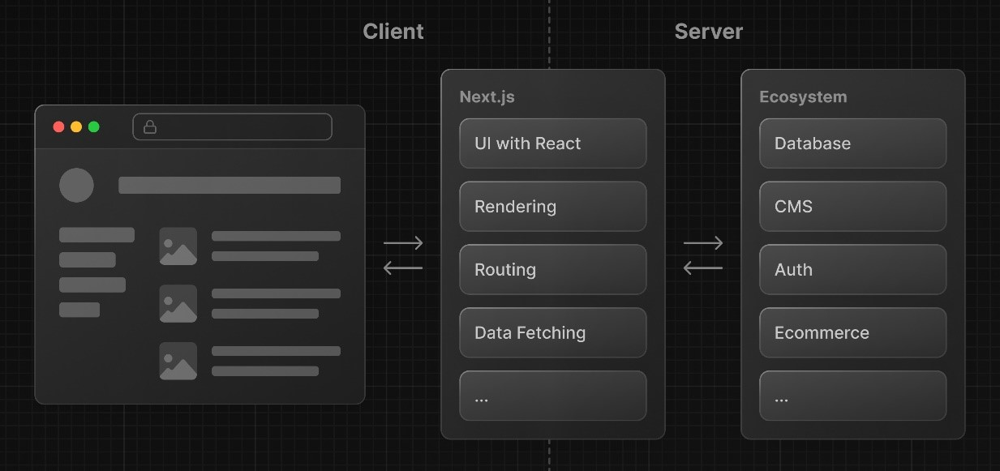
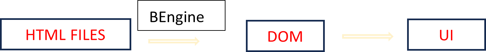
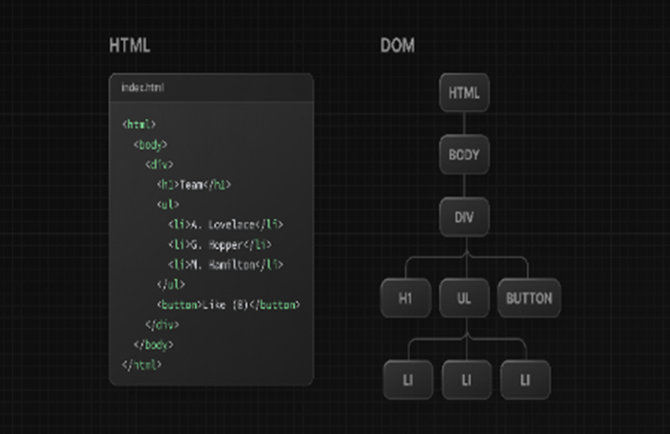

# What is React?

- A declarative Javascript library for building interactive user interfaces.

        It provides tools (components, pages, styles and modules) =                  structure (layout), features (pages and components), and                  optimizations (themes and speed tools; not used speed optimizers yet)
        

## What is meant by library?

- Functions (APIs)
- Can also be thought of as scripts.

## What is Next.js?

- A react framework providing legos to build web apps.

## What happens when a user visits a website?

1.	A client visits a site or webpage using a browser. The browser is the HTML server client.
2.	An HTML server (hosts HTML pages or documents) returns the HTML file corresponding to the web url.
3.	The browser reads the HTML and constructs the DOM. So browsers designed by google and mozilla have a function (by now I know it is a browser engine) or tool to convert HTML pages into DOMs. 

1.	The DOM has a tree-like structure with parent and child relationships. DOMs can be manipulated using JS. The HTML code contains the initial page content, and the DOM represents the updated page content changed by JS. This is also serve as my introduction to the node data structure.
2.	What is the core React library? React
3.	What is react-dom? DOM specific methods that enable me to use React with DOM

## What is JSX?

- An extension of JS.
